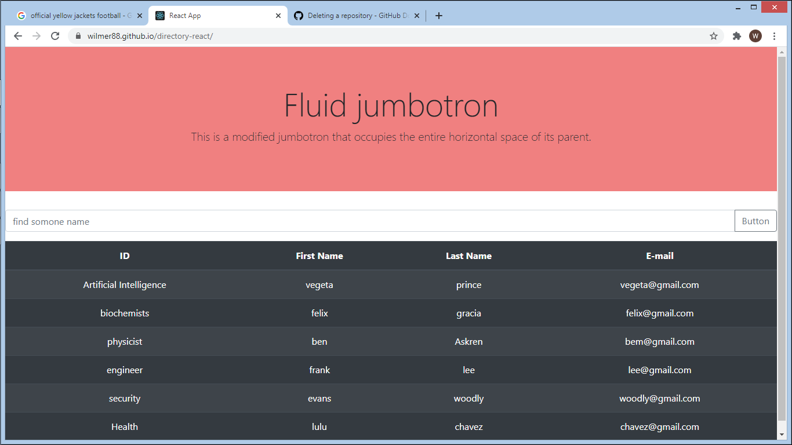

#employee-directory-react app

BCS bootcamp assingment was to create a employee directory, made to easly access all none-sensitive data on employess. When opening the app the user is shown a bootstrap table with the  employees id, first name, last name , and email. The user is able to search and filter  employees by clicking the search bar and typing the  employeed first name. 

Technologies used
<ul>
<li>js react</li>
<li>bootstrap framework</li>
</ul>

[this is the link to the page](https://wilmer88.github.io/directory-react/)
